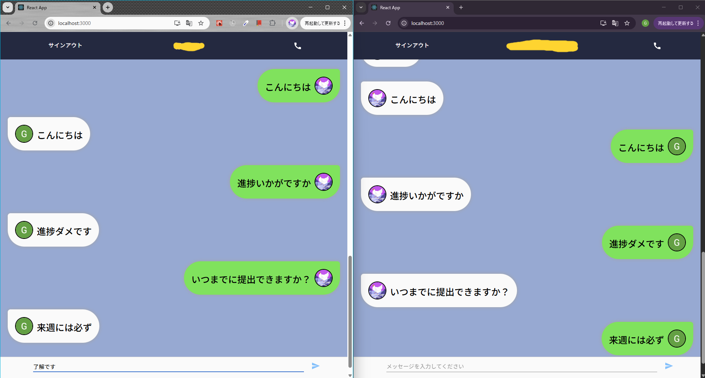
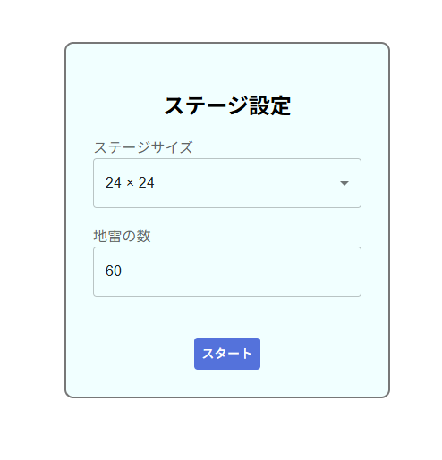
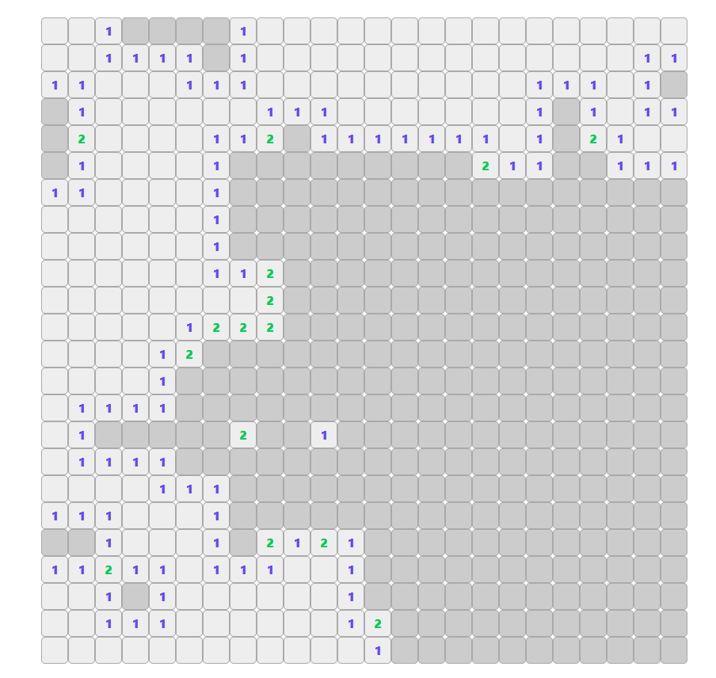
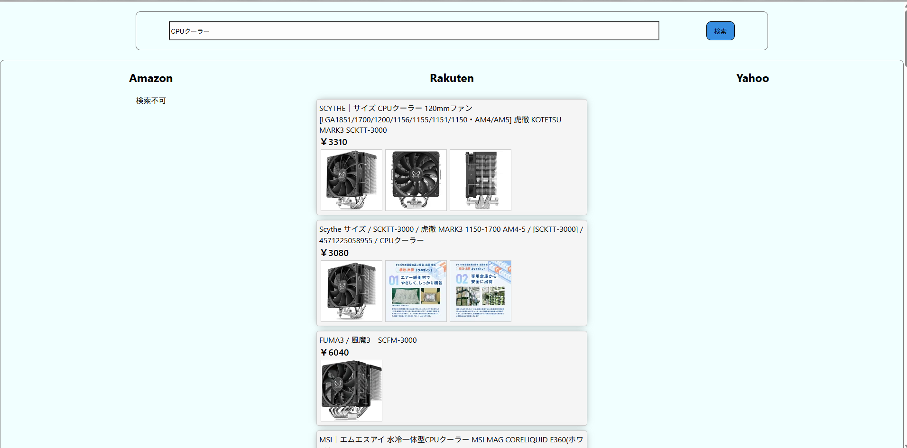
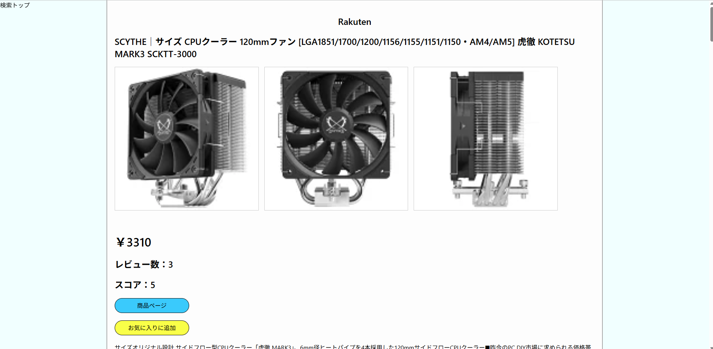
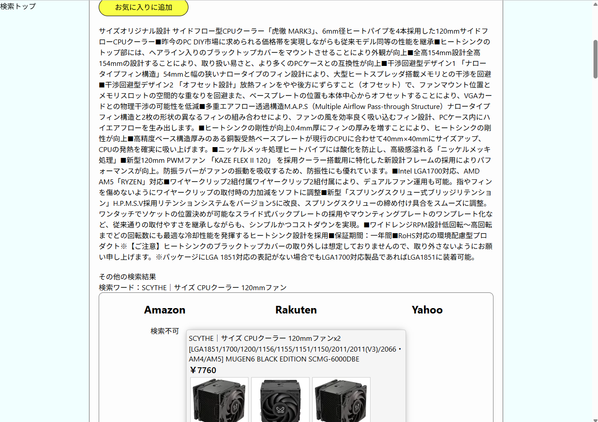
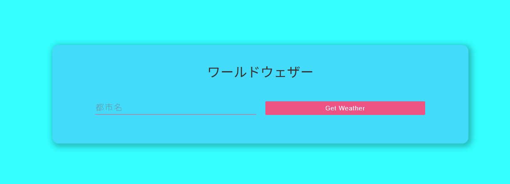
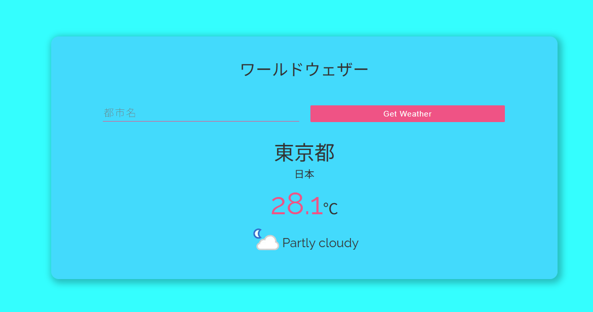

## JavaScript/React フロントエンド制作物  
   
### 1, チャットアプリ  
パス: JavaScript/React/chat-app  
フレームワーク: React + Firebase  
   
実際にGoogleアカウントでログインしテキストチャットを行うことができます。DBにはFirebaseを使用しフロント側でクエリを投げる構造です。  
（通話ボタンが表示していますが通話はできません。）  
  
   
   
### 2, マインスイーパー  
パス: JavaScript/React/ms-app  
フレームワーク: React + TypeScript + ReduxToolkit  
   
Reactでマインスイーパーを再現しました。マス数と爆弾数を指定可能です。  
  
   
マスを開ける、フラグを立てる、ゲームクリア、ゲームオーバーの機能を一通り揃えています。  
  
   
   
### 3, ネットショップ比較アプリ  
パス: JavaScript/React/shop-compare-app  
フレームワーク: React + Next.js + TypeScript + ReduxToolkit  
   
Amazon、楽天、Yahoo! のネットショップで同時に商品を検索できるアプリの予定でしたが、AmazonはAPI使用の審査が通らず断念しました。  
Yahoo!が期限切れで使用できなくなってしまいましたが、再申請すれば使用可能な見込みです。  
  
   
商品詳細画面から製品情報と製品ページへのリンク、さらに商品名をショップで検索した結果が表示されます。  
  
  
   
   
### 4, お天気アプリ  
パス: JavaScript/React/weather-app  
フレームワーク: React + TypeScript  
使用API： https://www.weatherapi.com/  
   
入力した都市の天気を確認できるアプリです。  
  
  
